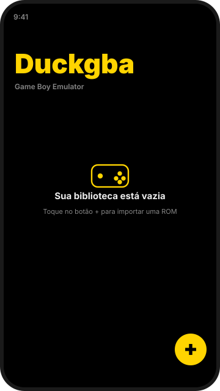
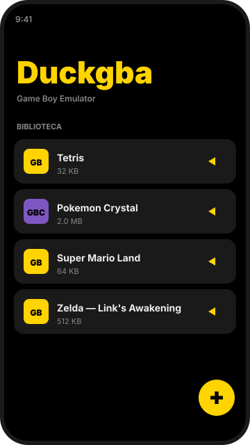
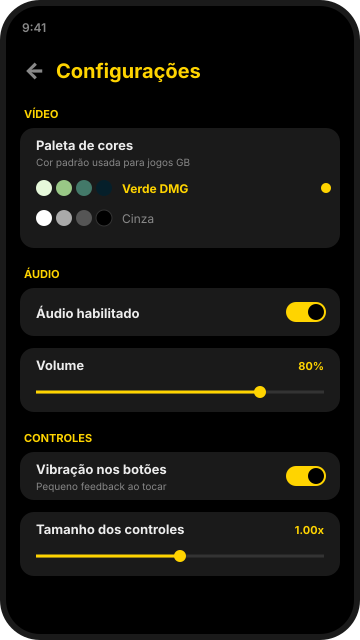
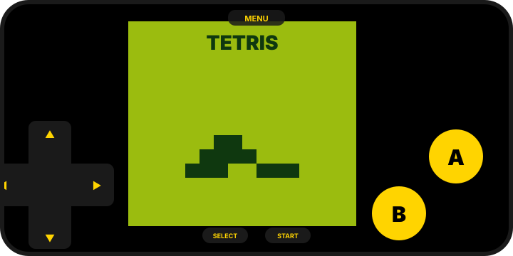

# Duckgba

> Um emulador de **Game Boy / Game Boy Color** para Android, com interface minimalista, controles na tela e diversas opções para tornar a experiência confortável em qualquer dispositivo.

<p align="center">
  
</p>

<p align="center">
  <a href="https://github.com/jaivedpereira/Duckgba/releases/latest"></a>
  <a href="https://github.com/jaivedpereira/Duckgba/actions/workflows/android.yml"></a>
  
  
</p>

---

## Download

A versão mais recente do APK é publicada automaticamente em **[Releases](https://github.com/jaivedpereira/Duckgba/releases/latest)**.

Baixe o arquivo `duckgba-release.apk` e instale no seu dispositivo Android (será necessário permitir a instalação de fontes desconhecidas).

> Requer Android 7.0 (API 24) ou superior.

## Recursos

- Suporte a Game Boy (DMG) e Game Boy Color (CGB)
- Importação de ROMs `.gb`, `.gbc`, `.rom` ou dentro de arquivos `.zip`
- Controles na tela com **multi-touch real** (segura A enquanto pressiona o D-Pad)
- D-Pad com detecção precisa por ângulo + zona morta para diagonais confortáveis
- Save states (salvar e carregar estado do jogo a qualquer momento)
- Battery save automático ao pausar
- 5 paletas de cores diferentes para jogos monocromáticos
- Tela cheia com fundo preto, sem distrações
- Áudio com `AudioTrack` em modo de baixa latência
- Vibração tátil opcional ao tocar nos controles
- Indicador de FPS opcional

## Capturas de tela

| Início (vazio) | Início (com ROMs) | Configurações | Em jogo |
|:---:|:---:|:---:|:---:|
|  |  |  |  |

## Como usar

1. Abra o Duckgba: você verá o nome do app sobre fundo preto e um botão **+** no canto inferior direito.
2. Toque no **+** e escolha **Importar ROM**. Selecione um arquivo `.gb`, `.gbc`, `.rom` ou `.zip` no seletor do Android.
3. A ROM aparecerá na biblioteca. Toque para jogar.
4. Durante o jogo, toque em **MENU** (no topo) ou no botão "voltar" para pausar e acessar:
   - **Retomar**
   - **Salvar estado** / **Carregar estado**
   - **Reiniciar**
   - **Sair do jogo**
5. As **Configurações** (botão **+** → Configurações) permitem mudar paleta, áudio, tamanho dos controles, velocidade da emulação e mais.

## Configurações disponíveis

| Categoria | Opção | Descrição |
|---|---|---|
| Vídeo | Paleta de cores | Verde DMG, cinza, pocket, âmbar ou azul |
| Vídeo | Manter proporção 10:9 | Mantém a proporção original do Game Boy |
| Vídeo | Escala inteira | Pixels nítidos sem suavização |
| Vídeo | Mostrar FPS | Exibe um contador de FPS na tela |
| Áudio | Habilitar áudio | Liga ou desliga totalmente o som |
| Áudio | Volume | Ajusta o volume de saída |
| Controles | Vibração | Pequeno feedback ao tocar nos botões |
| Controles | Tamanho | 0.6x a 1.4x |
| Controles | Opacidade | 20% a 100% |
| Emulação | Velocidade | 0.5x a 2.5x (turbo) |
| Emulação | Forçar DMG | Roda jogos coloridos no modo monocromático |
| Emulação | Pular BIOS | Inicia o jogo direto, sem a animação Nintendo |
| Emulação | Battery save | Salva o progresso de cartuchos com bateria |

## Tecnologias

- **Linguagem:** Kotlin (UI) + Java (core do emulador)
- **UI:** Jetpack Compose + Material 3
- **Mín SDK:** 24 (Android 7.0)
- **Compile SDK:** 34
- **Core de emulação:** baseado em [coffee-gb](https://github.com/trekawek/coffee-gb) por Tomek Rękawek (licença MIT)

A escolha do `coffee-gb` foi feita porque é um core escrito em Java puro, com **CPU cycle-accurate**, que passa em todos os testes Blargg, suporta MBC1-5, battery saves e save states. Por ser Java puro, não requer NDK/JNI — toda a emulação roda dentro da JVM Android.

## Compilando do código-fonte

Pré-requisitos:

- Android Studio Iguana ou superior (ou linha de comando com Android SDK 34 + JDK 17)

```bash
git clone https://github.com/jaivedpereira/Duckgba.git
cd Duckgba
./gradlew assembleDebug   # APK debug em app/build/outputs/apk/debug/
./gradlew assembleRelease # APK release em app/build/outputs/apk/release/
```

> Para gerar um release assinado configure `signingConfig` em `app/build.gradle.kts` ou injete uma chave via variáveis de ambiente.

## Estrutura do projeto

```
Duckgba/
├── app/                 # Aplicativo Android (Kotlin + Compose)
│   ├── DuckgbaApplication.kt
│   ├── MainActivity.kt
│   ├── audio/           # Saída de áudio com AudioTrack
│   ├── data/            # Repositórios de ROMs e configurações
│   └── ui/
│       ├── home/        # Tela inicial
│       ├── game/        # Tela de jogo + controles na tela
│       ├── settings/    # Tela de configurações
│       └── theme/       # Tema escuro Material 3
└── core/                # Módulo de emulação (Java)
    ├── com/duckgba/core/EmulatorEngine.java
    ├── eu/rekawek/coffeegb/core/  # Core coffee-gb embutido
    └── (shims internos para slf4j, commons-io, guava)
```

## Créditos

- **Core de emulação:** [coffee-gb](https://github.com/trekawek/coffee-gb) — Tomek Rękawek (MIT)
- **Documentação técnica do hardware:** [Pan Docs](https://gbdev.io/pandocs/), Blargg's test ROMs
- Feito por **jaivedpereira** com a ajuda do **Kiro**

## Aviso legal

Este aplicativo é apenas o **emulador**. Ele não distribui nem inclui qualquer ROM com direitos autorais. Use somente ROMs das quais você tenha o direito legal de usar (por exemplo, jogos comerciais que você possui o cartucho original ou homebrew/jogos de domínio público).

## Licença

Distribuído sob a licença MIT. Veja [`LICENSE`](LICENSE) para mais detalhes.

O core embutido `coffee-gb` é também licenciado sob a MIT por Tomek Rękawek — copyright preservado em [`core/src/main/java/eu/rekawek/coffeegb/`](core/src/main/java/eu/rekawek/coffeegb).
